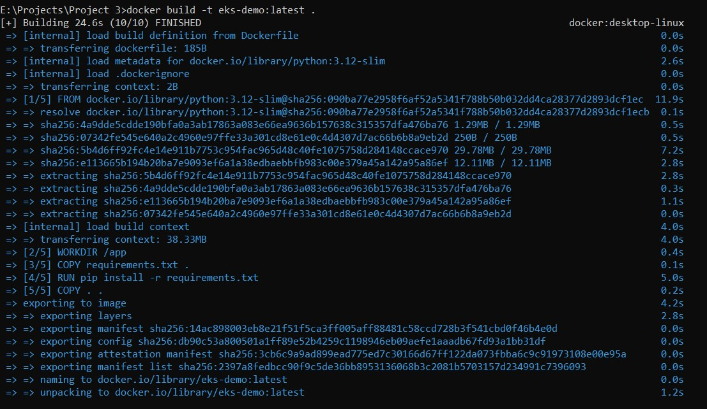
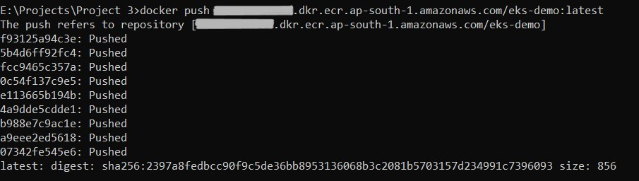
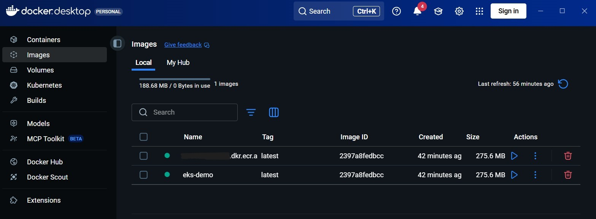
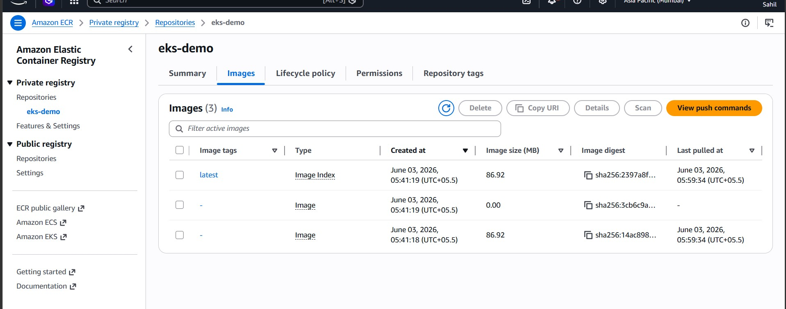
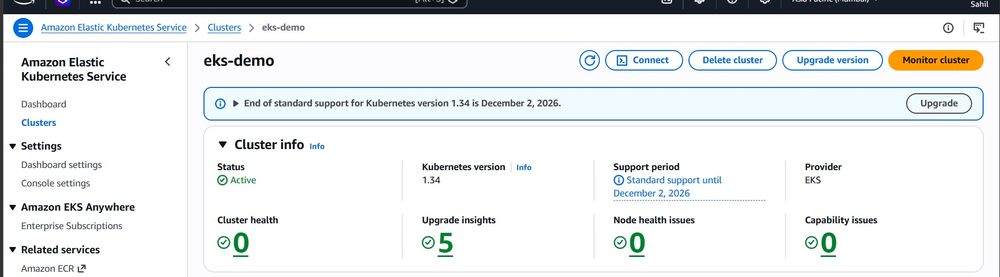
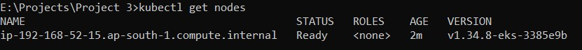
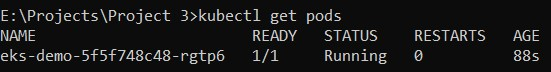
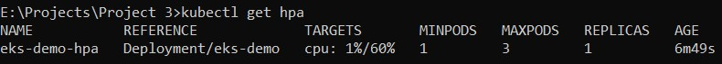
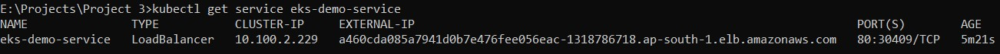

# 🚀 Containerized Flask App on AWS EKS

## 🌐 Live Demo
App was live at: http://a460cda085a7941d0b7e476fee056eac-1318786718.ap-south-1.elb.amazonaws.com
*(Cluster destroyed after project completion to avoid charges)*

## 🏗️ Architecture
Docker → ECR → EKS (Kubernetes) → LoadBalancer → User

## 🛠️ Tech Stack
- 🐍 Python Flask
- 🐳 Docker
- 📦 AWS ECR (Container Registry)
- ☸️ AWS EKS (Kubernetes)
- ⚙️ kubectl
- 🔧 eksctl
- 📈 HPA (Horizontal Pod Autoscaler)

## ✨ Features
- 🐳 Containerized Flask app using Docker
- 📦 Pushed image to AWS ECR
- ☸️ Deployed on EKS with 1 node (t3.small)
- 🌐 LoadBalancer service for public access
- 📈 HPA configured to auto-scale 1-3 pods at 60% CPU
- ❤️ Health check endpoint at /health

## 📸 Screenshots
### 🐳 Docker Build

### 📦 Docker Push to ECR

### 🖼️ Docker Images

### 📦 ECR Repository

### ☸️ EKS Cluster

### 🌐 App Live on Kubernetes

### 🖥️ kubectl get nodes

### 🐳 kubectl get pods

### 📈 kubectl get hpa

### 🌐 kubectl get service

## 💰 Cost
Cluster destroyed immediately after testing.
Total cost: ~$2-3 for a few hours of EKS usage.

## 📁 Files
- 📄 `app.py` — Flask application
- 🐳 `Dockerfile` — Container definition
- 📦 `requirements.txt` — Python dependencies
- ⚙️ `deployment.yaml` — Kubernetes deployment manifest
- 🌐 `service.yaml` — Kubernetes LoadBalancer service
- 📈 `hpa.yaml` — Horizontal Pod Autoscaler config
